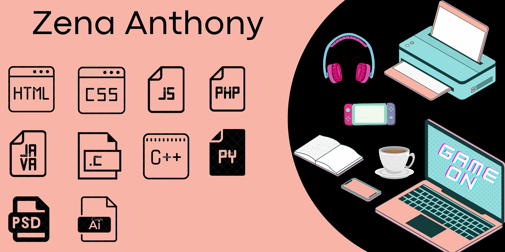

# Hey World! I'm Zena 👋🏽
Pronouns: She/Her/Hers 
🎇Open to job opportunities!🎇

## What I've Been Up To:
- 🏫--> I'm studying Computer Science at Carleton University, with a Minor in Business
- 💡--> I'm interested in developing web, mobile and desktop applications as well as graphic design 
- 👓--> I'm the Director of Academics for the Women in Computer Science Club, the Graphic Designer for the Women in Leadership Club and the VP of Social Media for the Data Science Club at Carleton University
- 🙋🏽--> I volunteer with the West Indian Youth Association of Ottawa
- 👯--> I'm an active member of: Technolgap, Carleton Computer Science Society
- 💻--> Working on: personal website, grocery inventory app, blog
- 💭--> Reach out to me about: graphic design, web development, gaming, caribbean recipes 🍽
- 🔍--> Quick outreach: hello@zenaanthony.me
- 😎--> Fun fact about me: I like to take aesthetically pleasing photos of the meals I cook 📸

## Let's connect!
- 📄 [LinkedIn](https://www.linkedin.com/in/zenaanthony/) --> Check out more of XP here!
- 🕹 Discord (Zee#7894) --> I am always down to play a game! 
