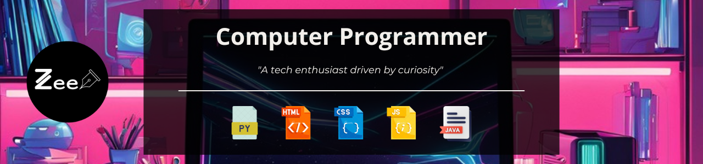

  <h1>Hi, I'm Zena 👋</h1>
  
I can print "Hello World" in 8 different programming languages 😎.

## Welcome To My Profile 😎

I'm a tech enthusiast passionate about learning software development, design, and other tech streams. I enjoy challenging myself, solving problems in creative ways, and learning new ways to automate tasks. Additionally, I share my learning journey on my tech blog [Devign with Zee](https://devignwithzee.wordpress.com/), where I hope to encourage and learn from others.

## Programming Languages 🧰

---
## Developer Tools 🧰

---
## Designer Tools

## What I've Been Up To 💪
- 🏫--> Studying: Software Development
- 🖊️--> Blogging: Sharing my learning in software development and design on [Devign with Zee](https://devignwithzee.wordpress.com/)
- 💻--> Building: character card web app 
- 👀 --> More Projects: [Zena's CodePen](https://codepen.io/zena-a)

