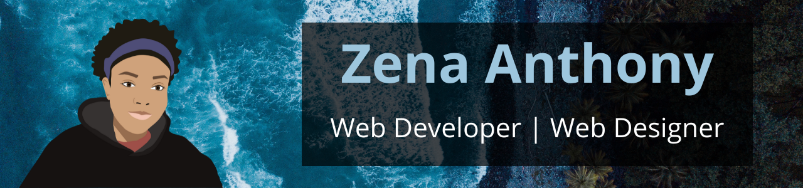

# Hey World! I'm Zena 👋🏽
Pronouns: She/Her/Hers 
🎇Open to job opportunities!🎇

## What I've Been Up To:
- 🏫--> I'm studying Computer Science at Carleton University, with a Minor in Business
- 💡--> I'm interested in developing web, mobile and desktop applications as well as web design. Aiming to become a digital nomad someday and share my journey with others!
- 🙋🏽--> I volunteer with the West Indian Youth Association of Ottawa
- 👯--> I'm an active member of: Technolgap, Web3 Academy, Design Buddies
- 💻--> Working on: grocery inventory app, ecommerce website, blog
- 💭--> Reach out to me about: web design, web development, gaming, caribbean recipes 🍽
- 🔍--> Quick outreach: hello@zenaanthony.me
- 😎--> Fun fact about me: I like to take aesthetically pleasing photos of the meals I cook 📸

## Check out my blog
[Devign with Zee](https://devignwithzee.com/home/)

## Let's connect!
- 📄 [LinkedIn](https://www.linkedin.com/in/zenaanthony/) --> Check out more of XP here!
- 🕹 Discord (Zee#7894) --> I am always down to play a game! 
