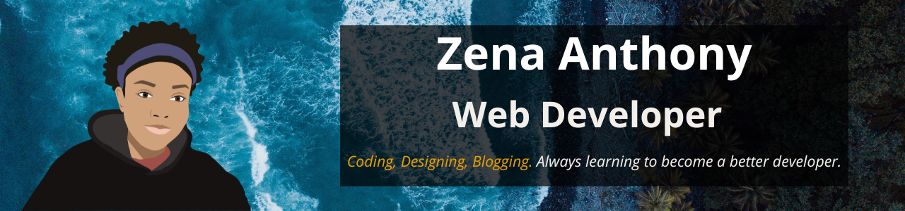

  <h1>Hi there! I'm Zena 👋</h1>
  
I enjoy coding for the web and designing (web, logo and digital art)

  
  
  

## Welcome to my Profile 😎

I'm from the Commonwealth of Dominica, with an <strong>Associate's Degree in Information Technology and Computer Science</strong>. I enjoy web development, specifically the frontend stack. I also dabble in web design, graphic design and digital art. Coding has helped me express my self creatively and challenge myself in solving problems and being a continuous learner. I hope to create more content sharing my coding journey, and mentor others. 

## Languages and Tools 🧰

---

## What I've Been Up To 💪
- 🏫--> I'm studying Computer Science at Carleton University, with a Minor in Business (3rd Year Student)
- 💻--> Working on: apartment rental website; grocery and inventory app 
- 💻--> Talk about web development and design on my blog: [Devign with Zee](https://devignwithzee.com/home/)
- 🗒️--> Learning about: React, and preparing for CISCO CCNA exams
- 👀 --> You can find some more of my projects here: [Zena's CodePen](https://codepen.io/zena-a)

## Let's connect!
- 🕹 Discord (zim-zena#7894) --> I am always down to play a game! 
- ☕ [Buy me a coffee](https://www.buymeacoffee.com/zenaanthony)! I keep it simple with a plain vanilla iced coffee.
