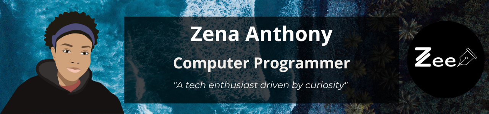

  <h1>Hi, I'm Zena 👋</h1>
  
I can print "Hello World" in 8 different programming languages 😎.

## Welcome to my Profile 😎

I'm a tech enthusiast passionate about learning software development, design, and other tech streams. After graduating college with an <strong>Associate's Degree in Computer Science and Information Technology</strong>, I decided to pursue further studies in tech, focusing on Computer Programming and Software Development. I enjoy challenging myself, solving problems in creative ways, and learning new ways to automate tasks. Additionally, I share my learning journey on my tech blog, where I hope to encourage and learn from others.

## Programming Languages 🧰

---
## Developer Tools 🧰

---
## Designer Tools

## What I've Been Up To 💪
- 🏫--> Studying: Computer Programming and IT Support
- 🖊️--> Blogging: Sharing my learning in software development and design on [Devign with Zee](https://devignwithzee.wordpress.com/)
- 💻--> Building: anime character card web app (sharing my favorite anime characters and their abilities)
- 👀 --> More Projects: [Zena's CodePen](https://codepen.io/zena-a)

## Let's connect!
- 🕹 Discord (zimzena)
